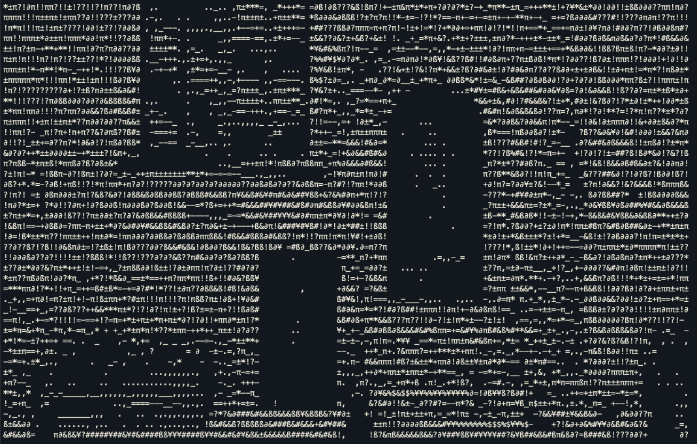

# ImageConverter
A side project to convert the image to symbol.

## How to use:
1. Install openCV, the whole program is based on the openCV. So please install it and make sure it's able to run.
2. Open your terminal, and insert the following command:
   ```
   // ex:
   java -Djava.library.path={path to your opencv folder} -classpath {the position you clone the repository}/ImageConverter:{the "jar" file of your openCV version} src.Main {image position} {0}
   
   // -Djava.library.path -> please insert your openCV direction
   // -classpath -> this line can be separate to two parts:
   //     1. Before separate comma : {Your direction}/ImageConverter/out/production/ImageConverter
   //     2. After separate comma : basicly point out the openCV jar file position, use the path for Djava.library.path plus the name of "jar" file.
   // src.Main -> It's the program itself.
   // parameter 1: the position of your image that want to convert.
   // parameter 2 (default to 0): [0, 1, 2] stands for ["normal", "Light-focus", "Dark-focus"], which can adjust the focus of the images. 
   
   // example:
   java -Djava.library.path=/opt/homebrew/Cellar/opencv/4.8.0_1/share/java/opencv4 -classpath /Users/andychen/Documents/Java/ImageConverter/out/production/ImageConverter:/opt/homebrew/Cellar/opencv/4.8.0_1/share/java/opencv4/opencv-480.jar src.Main /Users/andychen/Documents/Java/ImageConverter/Images/img4.jpg
   ```
3. The program will automatically save a txt file of the converted image in the position of your input image.

---

## Effect Present:

**Original image:**


**Converted image:**



<span style="color:red; font-size: 25px">
  The effect will be more apparent if the color of the image has less color. For instance, image from cartoon.
</span>